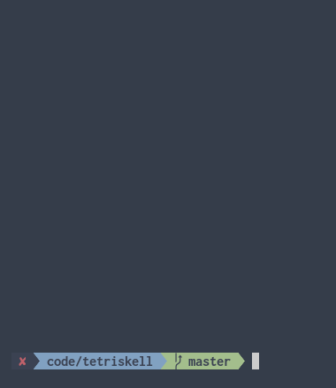

# tetriskell

Tetris implemented in the terminal in order to better learn Haskell.

To run, simply: `stack run`.

- `j`, `k`, `l` are left, down, right
- `u` rotates CW, `i` rotates CCW
- `spacebar` drops
